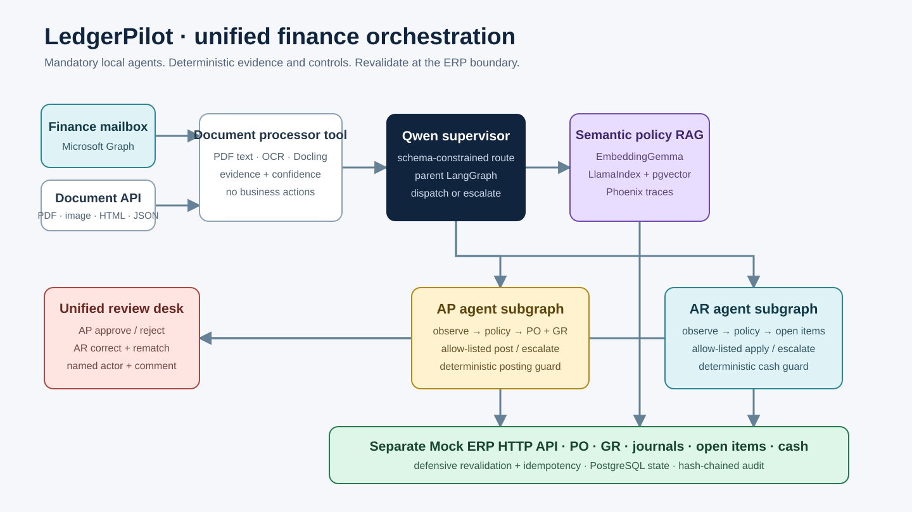

# LedgerPilot

LedgerPilot is an auditable agentic-finance prototype for accounts-payable invoices and accounts-receivable remittances. One document-processing layer converts and classifies mailbox or API attachments; a parent LangGraph orchestrator then dispatches the typed payload to an AP or AR subgraph. AP performs deterministic two-way/three-way matching and posts a Payment Journal, while AR mirrors the same retrieve-match-resolve/post pattern against open items and applies cash. Both use a separate stateful Mock ERP HTTP API.

The prototype intentionally separates probabilistic AI from financial controls: Docling and optional Ollama interpret documents, while a real LlamaIndex vector index and PostgreSQL/pgvector retrieve policy context. Deterministic code evaluates arithmetic, tolerances, duplicate rules, approval requirements, and posting eligibility.

## What is included

- Microsoft Graph shared-mailbox adapter plus unified PDF, image, HTML, text, and JSON ingestion at `POST /api/v1/ingest-document`.
- One canonical document layer with deterministic AP/AR classification, typed domain extraction, evidence, confidence, and backend-attempt traces; ambiguity is escalated instead of guessed.
- A parent LangGraph finance orchestrator that dispatches to independently controlled AP and AR LangGraph subworkflows.
- LlamaIndex `VectorStoreIndex` retrieval fused with PostgreSQL/pgvector policy ranking and an offline fallback.
- Two-way and three-way PO/GR matching with configurable tolerances, partial-invoice support, and bounded tax/freight/discount reconciliation.
- Exception detection for arithmetic mismatches, missing PO/line, duplicate invoice, vendor/currency mismatch, price/quantity/total variance, and receipt shortfall.
- Unified AP/AR exception desk plus domain-specific, audited human actions.
- Separate FastAPI Mock ERP service with PO, Goods Receipt, Payment Journal, open-AR-item, and cash-application endpoints; application containers use an HTTP client boundary.
- Mirrored AR document extraction, policy retrieval, deterministic allocation, review/correction/re-match, and idempotent cash application. Invalid matches cannot be force-approved.
- SHA-256 hash-chained audit events and optional PostgreSQL persistence.
- Durable PostgreSQL workflow state, journals, remittances, and policy embeddings.
- PostgreSQL 16 + pgvector schema, Ollama, and Arize Phoenix services.
- OpenAPI contract, automated tests, synthetic evaluation harness, architecture diagrams, and presentation deck.

## Architecture



The editable Mermaid sources and a detailed explanation are in [docs/architecture.md](docs/architecture.md). The implementation-to-requirement mapping is in [docs/traceability-matrix.md](docs/traceability-matrix.md).

## Quick start: Docker Compose

Prerequisites: Docker Desktop with Compose v2 and at least 6 GB of free memory for the optional AI services.

```powershell
Copy-Item .env.example .env
docker compose up --build -d postgres mock-erp api
Invoke-RestMethod http://localhost:8000/api/v1/health
Invoke-RestMethod http://localhost:8080/erp/v1/health
```

Compose uses the named `ledgerpilot-unified-postgres-data` volume by default. This isolates the unified workflow schema and audit chain from any pre-refactor local demo volume without deleting the older data. Override `POSTGRES_VOLUME_NAME` when a different retained environment is intentional.

Open:

- Swagger UI: <http://localhost:8000/docs>
- ReDoc: <http://localhost:8000/redoc>
- Human review queue: <http://localhost:8000/review>

Run the AP happy-path demo:

```powershell
.\scripts\demo.ps1
```

Start optional local AI and observability services:

```powershell
docker compose --profile ai --profile observability up --build -d
docker compose exec ollama ollama pull llama3.2:3b
```

Phoenix is then available at <http://localhost:6006>.

OCR models are downloaded into the container's temporary cache on first image processing. For a reusable local evaluation cache, mount a volume at `/tmp` as shown in `docs/evaluation-report.md` or run the Compose API service normally.

## Local development

The evaluation dependency set is tested on Python 3.12. Use the Docker workflow when a newer host interpreter is installed.

```powershell
py -3.12 -m venv .venv
.\.venv\Scripts\Activate.ps1
python -m pip install -e ".[dev,eval]"
uvicorn app.main:app --reload
```

Run verification:

```powershell
python -m pytest
python evaluation\run_evaluation.py
python evaluation\run_ar_evaluation.py
python evaluation\run_rag_evaluation.py
docker compose config --quiet
```

## API walkthrough

The canonical contract is [openapi/openapi.yaml](openapi/openapi.yaml). The five mandatory endpoints are implemented verbatim.

The preferred cross-domain entry point is `POST /api/v1/ingest-document`. It classifies and dispatches a document end-to-end. The mandatory `/ingest-invoice`, `/match-po`, and `/post-payment-journal` endpoints remain compatibility wrappers for the explicit AP walkthrough.

```powershell
# 1. Ingest a fixture
$ingested = Invoke-RestMethod -Method Post `
  -Uri http://localhost:8000/api/v1/ingest-invoice `
  -Form @{ file = Get-Item evaluation\fixtures\po-1001-invoice.json }

# 2. Run a three-way match
$body = @{ invoice_id = $ingested.invoice.id; require_goods_receipt = $true } | ConvertTo-Json
$match = Invoke-RestMethod -Method Post `
  -Uri http://localhost:8000/api/v1/match-po `
  -ContentType application/json -Body $body

# 3. Verify an idempotent replay. With AUTO_POST_ENABLED=true, step 2 already posted it.
$journal = Invoke-RestMethod -Method Post `
  -Uri http://localhost:8000/api/v1/post-payment-journal `
  -Headers @{ "Idempotency-Key" = "auto:$($ingested.invoice.id)" } `
  -ContentType application/json `
  -Body (@{ invoice_id = $ingested.invoice.id } | ConvertTo-Json)

# 4. Inspect decision provenance
Invoke-RestMethod "http://localhost:8000/api/v1/audit-log?entity_id=$($ingested.invoice.id)"
```

To test an exception, ingest `evaluation/fixtures/po-1001-price-variance.json`. Reviewers can approve or reject through `POST /api/v1/exceptions/decision`. Set `REQUIRE_HUMAN_APPROVAL=true` to require approval even for a clean match. Set `AUTO_POST_ENABLED=false` when you want matching and posting to remain two separate demo steps.

### Unified AP/AR dispatch

```powershell
# Let the parent orchestrator classify and dispatch an AR document.
$ar = Invoke-RestMethod -Method Post `
  -Uri http://localhost:8000/api/v1/ingest-document `
  -Form @{ file = Get-Item evaluation\fixtures\remittance-clean.json }

# Inspect the durable domain workflow state and audit provenance.
Invoke-RestMethod "http://localhost:8000/api/v1/workflows/$($ar.entity_id)"
Invoke-RestMethod "http://localhost:8000/api/v1/audit-log?entity_id=$($ar.entity_id)"
```

AR exceptions expose `RETRY_WITH_CORRECTION`, `REJECT`, and `MARK_MANUALLY_RESOLVED` at `POST /api/v1/remittance-exceptions/decision`. When global approval is enabled, `APPROVE_APPLY` is accepted only for a remittance that already passed deterministic matching. Every correction is re-matched against current ERP state before cash is applied.

### Variance-code reference

| Code | Meaning |
|---|---|
| `AMOUNT_OUT_OF_RANGE` | A monetary value exceeds the configured prototype ceiling or is negative. |
| `QUANTITY_OUT_OF_RANGE` | A quantity exceeds the prototype ceiling or is zero or negative. |
| `LINE_DETAIL_MISSING` | The invoice has no line-level detail for PO matching. |
| `LINE_AMOUNT_MISMATCH` | A line amount does not equal quantity multiplied by unit price. |
| `SUBTOTAL_MISMATCH` | The declared subtotal does not equal the sum of invoice lines. |
| `INVOICE_TOTAL_MISMATCH` | The final total does not reconcile with subtotal, tax, freight, and discount. |
| `TAX_VARIANCE` | Tax exceeds the configured percentage of invoice subtotal. |
| `FREIGHT_VARIANCE` | Freight exceeds the configured percentage of invoice subtotal. |
| `DISCOUNT_VARIANCE` | Discount exceeds the configured percentage of invoice subtotal. |
| `DUPLICATE_INVOICE` | The vendor and invoice-number combination already exists. |
| `MISSING_PO` | The referenced purchase order was not found. |
| `VENDOR_MISMATCH` | The invoice vendor differs from the purchase-order vendor. |
| `CURRENCY_MISMATCH` | The invoice currency differs from the purchase-order currency. |
| `MISSING_PO_LINE` | An invoice line cannot be mapped to a purchase-order line. |
| `PRICE_VARIANCE` | Unit price exceeds the configured tolerance. |
| `QUANTITY_VARIANCE` | Invoiced quantity exceeds the configured tolerance or ordered quantity. |
| `RECEIPT_SHORTFALL` | Invoiced quantity exceeds the goods-received quantity. |
| `TOTAL_VARIANCE` | The goods subtotal exceeds the expected PO value beyond tolerance. |

AP invoice exceptions appear at `GET /api/v1/exceptions` and support an explicit decision workflow. Failed AR applications appear separately at `GET /api/v1/remittance-exceptions` for operator follow-up; the prototype does not provide an AR approval override.

## Shared mailbox configuration

Register a Microsoft Entra application with application permission `Mail.Read` scoped to the target shared mailbox, then set:

```text
GRAPH_TENANT_ID=...
GRAPH_CLIENT_ID=...
GRAPH_CLIENT_SECRET=...
GRAPH_MAILBOX=ap-invoices@example.com
GRAPH_FOLDER=Inbox
```

The Compose service explicitly passes these values into the API container. Call `POST /api/v1/mailbox/poll?max_messages=10`. The adapter accepts PDF, PNG/JPEG, HTML, text, and JSON attachments. Production deployment should store the client secret in a secret manager and replace polling with a Graph subscription or queue-triggered worker.

## Configuration

| Variable | Default | Purpose |
|---|---:|---|
| `MATCH_PRICE_TOLERANCE_PCT` | `2.0` | Maximum unit-price variance |
| `MATCH_QUANTITY_TOLERANCE_PCT` | `0.0` | Maximum ordered-quantity variance |
| `MATCH_TOTAL_TOLERANCE_PCT` | `2.0` | Maximum goods-subtotal variance against the PO |
| `MATCH_MAX_TAX_PCT` | `25.0` | Maximum tax as a percentage of invoice subtotal |
| `MATCH_MAX_FREIGHT_PCT` | `10.0` | Maximum freight as a percentage of invoice subtotal |
| `MATCH_MAX_DISCOUNT_PCT` | `30.0` | Maximum discount as a percentage of invoice subtotal |
| `MAX_MONETARY_AMOUNT` | `1000000000.00` | Positive prototype ceiling for invoice and remittance monetary fields; set per deployment and currency scope |
| `REQUIRE_HUMAN_APPROVAL` | `false` | Require explicit approval before every posting |
| `AUTO_POST_ENABLED` | `true` | Deployment policy flag for automatic posting |
| `OLLAMA_MODEL` | `llama3.2:3b` | Local model used by optional AI extensions |
| `LLM_EXTRACTION_ENABLED` | `false` | Ask Ollama for schema-constrained invoice JSON before regex fallback |
| `LLM_EXPLANATIONS_ENABLED` | `false` | Generate non-authoritative reviewer explanations with Ollama |
| `DATABASE_URL` | `memory://` locally | PostgreSQL connection string |
| `MAX_UPLOAD_MB` | `15` | Attachment size limit |

## ERP integration boundary

`app/erp.py` contains the sandbox `MockERP`. Its three operations map cleanly to a real adapter:

1. `get_purchase_order()` retrieves PO lines and received quantities.
2. `post_payment_journal()` posts an approved AP journal with an idempotency key.
3. `apply_cash()` applies an AR receipt to referenced open items.

For SAP, Oracle, or NetSuite, implement the same interface, map external IDs into the audit payload, use service-to-service authentication, and retain the upstream request/response reference rather than secrets or full sensitive documents.

## Evaluation results

The checked-in document benchmark has seven synthetic documents across JSON, PDF, scan-like PNG, and HTML. One HTML case is explicitly forced through Docling, so the mandatory processor is exercised rather than merely importable. A separate four-query labeled policy set runs RAGAS non-LLM retrieval metrics over the real LlamaIndex path.

| Metric | Result |
|---|---:|
| Field-level extraction accuracy | 100.00% |
| Match-decision accuracy | 100.00% |
| Exception-classification accuracy | 100.00% |
| Exception-routing recall | 100.00% |
| Evaluation coverage | 100.00% |
| Straight-through-processing rate | 57.14% |
| False auto-post rate | 0.00% |
| Audit-chain integrity | 100.00% |
| RAGAS context precision | 100.00% |
| RAGAS context recall | 100.00% |

These numbers validate controlled behavior, not production generalization. A production pilot must use representative, permissioned invoices and report confidence intervals by vendor/template. See [docs/evaluation-report.md](docs/evaluation-report.md).

## Security and control posture

- Containers run as a non-root user with a read-only filesystem and `no-new-privileges`.
- Uploads are size-limited; mailbox attachments are allow-listed by extension.
- Deterministic duplicate detection and hash-chained audit events support duplicate and tamper controls.
- Posting requires a successful deterministic match and is idempotent.
- Human decisions require a supplied actor and comment and become audit events. The actor is not authenticated in this prototype; production requires SSO/RBAC and segregation of duties.
- No credentials are committed; `.env` is ignored.

This remains a prototype. Before production: add malware scanning, object-store encryption, row-level authorization, SSO/RBAC, secret-manager integration, queue-based workers, retention policies, PII redaction, database migrations, ERP-specific reconciliation, model/red-team evaluation, and disaster recovery. See [docs/security-and-controls.md](docs/security-and-controls.md).

## Repository map

```text
app/                    Parent orchestrator, AP/AR graphs, shared extraction, controls, adapters
db/schema.sql           PostgreSQL + pgvector schema
evaluation/             fixtures, labels, evaluator, reproducible results
tests/                  unit and workflow tests
openapi/openapi.yaml    versioned API contract
docs/                   architecture, controls, evaluation, traceability
presentation/           12-slide assignment deck
scripts/demo.ps1        end-to-end API demo
docker-compose.yml      API, Mock ERP HTTP service, PostgreSQL, Ollama, Phoenix
```
